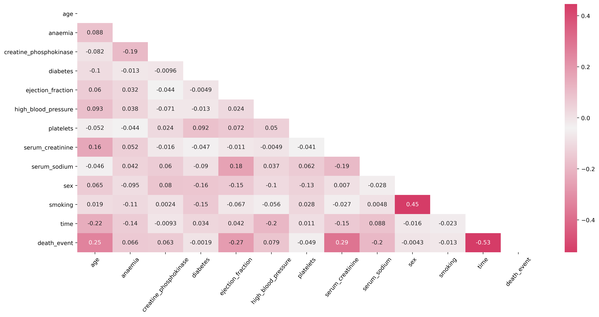
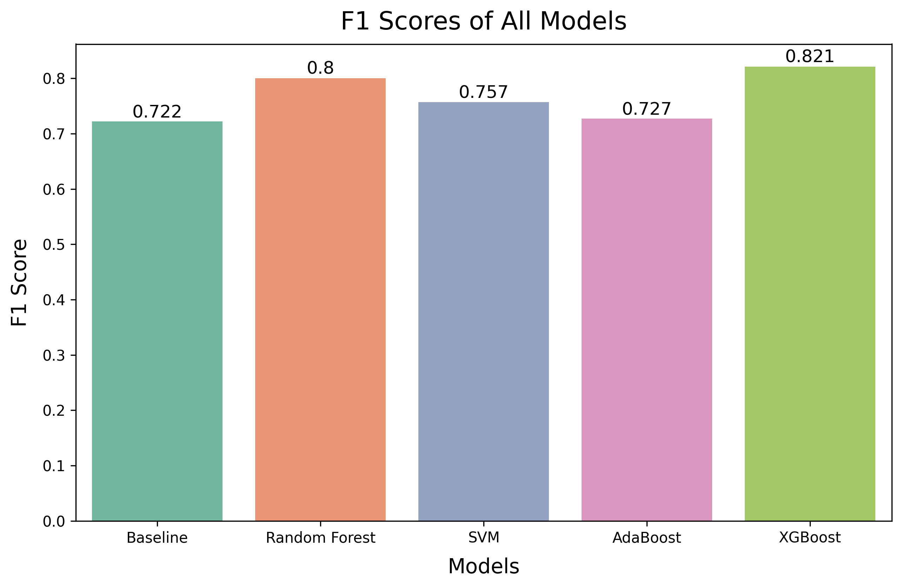
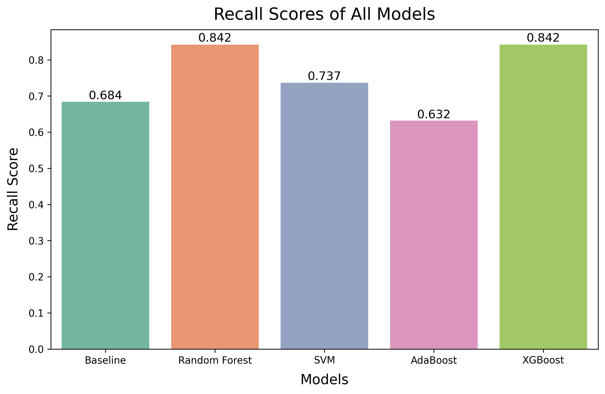
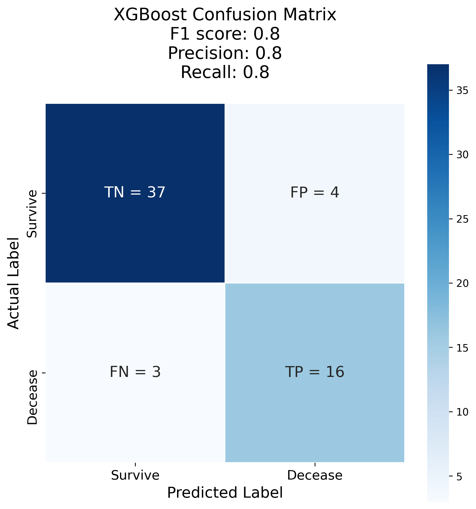

#  Capstone: Heart Failure Mortality Prediction

## Problem Statement

With earlier care and attention given, mortality by heart failure can be prevented. Thus, the hospital's newly established Data Science Department has been tasked by the Department of Cardiology to find a way to identify patients with high risks of mortality by heart failure through the use of data science, so as to provide the necessary preventive care and attention early.

**To achieve this, the project aims to build a classifier which uses patients' existing health conditions to accurately predict mortality by heart failure.**

## Background

The heart has 4 chambers (right and left atriums on top, right and left ventricles below) in which blood flows through [(source)](https://medlineplus.gov/ency/imagepages/19612.htm). 

The right atrium receives blood from the veins and pumps it into the right ventricle. The right ventricle then pumps the blood into the lungs to fill the blood with oxygen.

The left atrium receives the oxygenated blood from the lungs and pumps it into the left ventricle (which is usually the strongest chamber). The left ventricle then pumps the oxygenated blood to the rest of the body [(source)](https://www.webmd.com/heart/picture-of-the-heart).

When the heart contracts, blood is pumped out from the ventricles and when the heart relaxes, the ventricles are refilled with blood from the atriums. There will always be some blood left in the ventricles as blood can never be fully pumped out of the ventricles no matter how forceful the heart contracts [(source)](https://www.mayoclinic.org/ejection-fraction/expert-answers/faq-20058286). 

Heart failure occurs when the heart muscle is unable to pump blood as well as it should and the patient does not get enough oxygen [(source)](https://www.heart.org/en/health-topics/heart-failure/what-is-heart-failure). Heart failure has no cure and can be fatal if not detected and managed early [(source)](https://www.heart.org/en/health-topics/heart-failure/treatment-options-for-heart-failure) [(source)](https://www.mayoclinic.org/diseases-conditions/heart-failure/symptoms-causes/syc-20373142).

There are many different types of heart failure, with the most common being [(source)](https://my.clevelandclinic.org/health/diseases/17069-heart-failure-understanding-heart-failure):

|Type of Heart Failure|Description|
|:--|:--|
|Heart Failure with Reduced Ejection Fraction (**HF-rEF**)|Left ventricle enlarges, becoming unable to contract normally and as a result, the heart fails to pump with enough force to push sufficient amount of oxygenated blood into circulation around the body|
|Heart Failure with Preserved Ejection Fraction (**HF-pEF**)|Heart pumps normally but the ventricles are unable to relax properly as the muscles are thicker and stiffer than usual. This results in ventricles not getting filled all the way, causing lesser blood to be pumped to the rest of the body|

A frequent cause of heart failure is cardiovascular diseases (CVDs) [(source)](https://world-heart-federation.org/cvd-roadmaps/whf-global-roadmaps/heart-failure/). CVDs have consistently been a leading cause of death globally [(source)](https://world-heart-federation.org/resource/cardiovascular-diseases-cvds-global-facts-figures/). In 2019, it took an estimate of 17.9 million lives, which accounts to about 32% of all deaths that year [(source)](https://www.who.int/news-room/fact-sheets/detail/cardiovascular-diseases-(cvds)). 

Fortunately, most CVDs can be prevented by addressing various behavioural risk factors in everyday life like unhealthy diet and obesity, tobacco use and lack of physical exercise [(source)](https://www.mayoclinic.org/diseases-conditions/heart-failure/symptoms-causes/syc-20373142). 

Patients with other underlying conditions such as high blood pressure are also at high risk of developing CVDs [(source)](https://www.cdc.gov/globalhealth/healthprotection/ncd/cardiovascular-diseases.html). 

Therefore, for patients with CVDs or are at high risk of CVDs, early detection and management of these risk factors and underlying conditions is key to preventing mortality by heart failure [(source)](https://www.who.int/news-room/fact-sheets/detail/cardiovascular-diseases-(cvds)). 

The dataset used in this project contains 299 patients with heart failure and was obtained from the research article ["Machine learning can predict survival of patients with heart failure from serum creatinine and ejection fraction alone"](https://bmcmedinformdecismak.biomedcentral.com/articles/10.1186/s12911-020-1023-5#Abs1) (Chicco & Jurman, 2020).

## Data Dictionary

|Feature|Type|Dataset|Description|
|---|---|---|---|
|**age**|*float*|all datasets|Patient's age at time of diagnosis| 
|**anaemia**|*integer*|heart_failure_clinical_records_dataset.csv|If the patient has a decrease of red blood cells or hemoglobin (1 for yes, 0 for no)| 
|**creatine_phosphokinase**|*integer*|heart_failure_clinical_records_dataset.csv|Level of the CPK-MB enzyme in the blood (mcg/L)| 
|**diabetes**|*integer*|heart_failure_clinical_records_dataset.csv|If the patient has diabetes, a disease characterised by elevated blood sugar level (1 for yes, 0 for no)| 
|**ejection_fraction**|*integer*|all datasets|Percentage of blood leaving the heart at each contraction (percentage)| 
|**high_blood_pressure**|*integer*|heart_failure_clinical_records_dataset.csv|If the patient has hypertension, a condition where the pressure in the blood vessels are persistently elevated (1 for yes, 0 for no)| 
|**platelets**|*float*|heart_failure_clinical_records_dataset.csv|Platelets in the blood (kiloplatelets/mL)| 
|**serum_creatinine**|*float*|all datasets|Level of serum creatinine in the blood (mg/dL)| 
|**serum_sodium**|*integer*|heart_failure_clinical_records_dataset.csv|Level of serum sodium in the blood (mEq/L)| 
|**sex**|*integer*|heart_failure_clinical_records_dataset.csv|Gender of patient (1 for male, 0 for female)| 
|**smoking**|*integer*|heart_failure_clinical_records_dataset.csv|If the patient smokes (1 for yes, 0 for no)| 
|**time**|*integer*|all datasets|Follow-up period (days)| 
|**death_event**|*integer*|all datasets|If the patient deceased during the follow-up period (1 for yes, 0 for no)| 

## Analysis Summary

It was revealed during the EDA that many of the features in the original dataset, while originally thought to have a larger impact on the predictions, turned out to have very little correlation with our target variable, the death event. The features eventually chosen and used in the modelling were age, ejection fraction, serum creatine and time. These features were chosen as they had a correlation above an absolute value of 0.25 with the target variable.

**The models were evaluated based on various metrics such as the F1 score, the Precision-Recall score and the Train/Test Accuracy.**

We prioritised finding the model with the highest F1 score since it is an indication of the model's accuracy on the dataset and performance as a whole.

We also paid special attention to the Recall score. The reason for this is because Recall score is sensitive to the number of False Negatives, which in this project where we predict mortality by heart failure, is something that we want to reduce as much as possible.

For False Negatives, what it essentially means is that we wrongly predicted that the patient's condition is not as severe and that they will survive, but in reality they actually succumbed to heart failure. This is a deadly misclassification as it might result in the patient not receiving earlier care and attention that may have potentially saved their life.

With this in mind, we paid special attention to get as high a Recall score as possible.

|Models|F1-score|Precision|Recall|Train Accuracy|Test Accuracy|
|:---:|:---:|:---:|:---:|:---:|:---:|
|**Baseline**|0.722|0.765|0.684|0.820|0.833|
|**Random Forest**|0.800|0.762|0.842|0.795|0.783|
|**SVM**|0.757|0.778|0.737|0.816|0.850|
|**AdaBoost**|0.727|0.857|0.631|0.849|0.733|
|**XGBoost**|**0.821**|0.800|**0.842**|0.862|0.833|

Above is a table showing a summary of the scores of all the different models. 
Comparing the metrics, we found the **XGBoost Classifier** model to be the best performer for heart failure prediction with 82% F1 score, 84% Recall, 80% Precision, 86% Train Accuracy and 83% Test Accuracy.

## Conclusions/Recommendations

The model may serve as an aid for easier identification of the patients most at risk of mortality from heart failure and allow doctors and nurses to better focus their attention and allocate resources to the patients who needs it most.

Recommendations for the improvement of results include:
- Further tuning of hyperparameters to achieve more accurate predictions
- More rows of data to train model with since current dataset is relatively small
- More specific details on patients' underlying conditions like subtypes of diseases

Recomendations for further development beyond the current project include:
- Create a model that can reflect the severity of patients' conditions and generate likelihood of mortality from heart failure
- Apply model to predict other types of causes of deaths such stroke